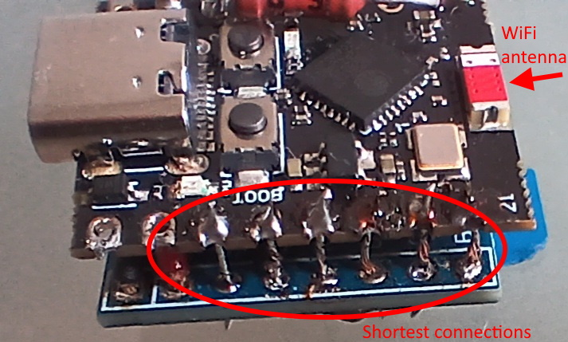
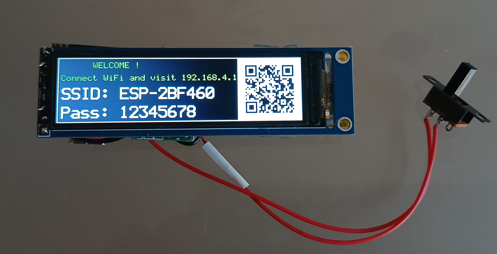
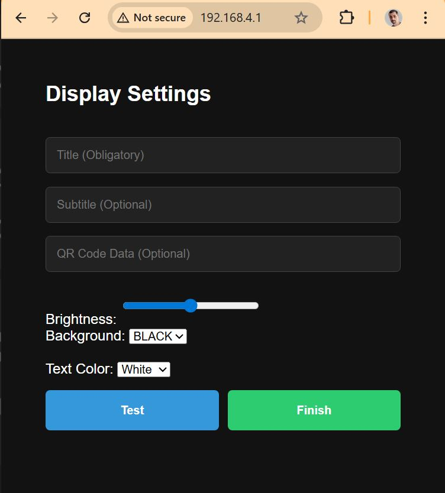
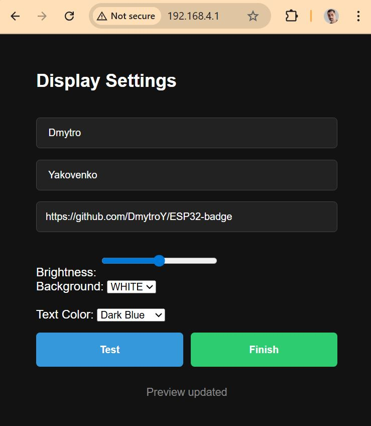
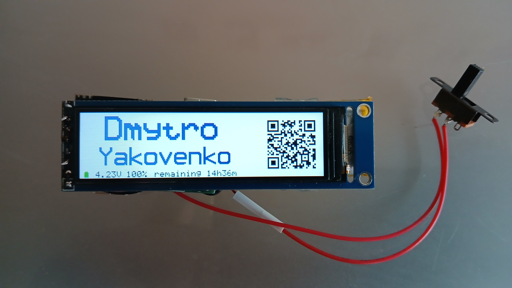
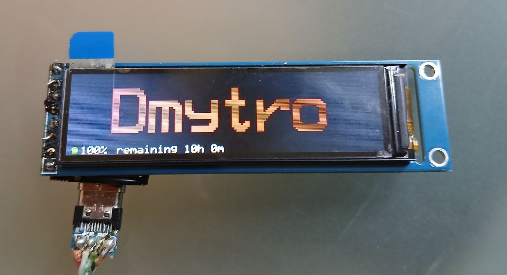

# Electronic Conference Badge (ESP32)
A low-power embedded system featuring a custom display driver, web-based asynchronous configuration portal.
Is a result of full-stack embedded development, from low-level SPI driver authorship to UI/UX and power profiling.

## 1.Technical Overview
The system utilizes an ESP32 Super Mini to drive a 76x284 ST7789 LCD. With integrated WiFi it hosts a local web server to customize text, colors, and QR codes. Then transit into a power-efficiency monitoring state to maximize battery life while maintaining the display.

### 1.1. Custom Driver Development (ST7789)
Existing libraries failed to support the non-standard 76x284 resolution and integrated backlight control efficiently. So I developed a dedicated driver (lib/ST7789_76x284/) supporting drawing primitives, text rendering, and QR code generation. As important feature for this project the driver has integrated LEDC-based PWM for fine-grained backlight brightness control, allowing users to balance visibility against power consumption. 

[Driver API documentation link.](https://github.com/DmytroY/ESP32-badge/tree/main/lib/ST7789_76x284)


### 1.2. High-Frequency Hardware Integration & EMI Mitigation
During prototyping, long trace lengths led to significant RF interference between the WiFi antenna and the SPI bus/PWM signals. So I optimized physical pinout which allows reduce betwing boards connection lengths to <5mm for critical high-speed lines (SCLK, MOSI) and move the antenna to the edge of the device. This effectively eliminated signal crosstalk and ensured stable work of SPI and WiFi.

**NB !** 
- SCLK: 7
- MOSI: 8
- CS: 20
- DC: 10
- RST: 9
- Backlight (BL): 21
- Battery ADC: 0

 this ESP32 to LCD pinout is recomended to keep connections as short as possible and WiFi antenna on the edge of the device which prevents EMI.




### 1.3. Power Management & Battery Analytics
To achieve maximum operational uptime without losing the display state, the system employs next power strategy:

#### Optimized Light Sleep.
Since the display requires a PWM signal for the backlight, Deep Sleep was bypassed in favor of Light Sleep. This maintains the oscillator and pin registers while powering down the majority of the SoC.

#### Battery measurement Logic.
* ESP32-specific ADC non-linearity mitigated by implementing ADC characterization.
``` esp_adc_cal_characterize(ADC_UNIT_1, ADC_ATTEN_DB_11, ADC_WIDTH_BIT_12, 1100, &adc_chars); ```

* Digital Signal Processing using an Exponential Moving Average (EMA) filter to stabilize voltage readings:
``` bat_v = (bat_v_raw * 0.1f) + (bat_v * 0.9f);```

* to calculate remaining battery capacity accurately I use approximated voltage zones of non-linear voltage/capacity function of Li-Ion battery then provide real-time runtime estimates.

### 1.4. Software Architecture
The badge implements a "headless" configuration mode to keep the firmware footprint small and the UI responsive.

* Filesystem: HTML, CSS, and JS assets are decoupled from the binary and stored in Flash memory via **LittleFS**.

* Asynchronous Communication: The configuration portal uses **AJAX** (XMLHttpRequest) to submit user data (Title, Subtitle, Colors) without page refreshes, ensuring a seamless user experience.

### 1.5. Helper Utilities
The helper.cpp file provides procedures for
- File Serving: Logic for handling LittleFS file requests for the web server.
- Power Management: Routines for deep sleep and wake cycles.
 - Battery Diagnostics: Procedures for measuring ADC voltage and rendering battery status/remaining time indicators on the screen.


## 2. Hardware Configuration
- MCU: ESP32 Super Mini
- Display: ST7789 LCD (76x284 resolution)
- Power: Li-Ion Battery + DC/DC converter to 3.3V
- Charging: 5V Li-Ion charger controller
- Battery Sensing: 7.5k / 6.2k divider connects battery to PIN_0 (ADC) and shifts voltage to optimal ADC range.


## 3. Software Installation notes
I have used PlatformIO IDE extension in VS Code. After cloning repository do not forget that Filesystem Image and main code should be uploaded separatelly:

- Upload to ESP32 filesystem: Open the PlatformIO sidebar, go to Project Tasks > Platform > Build Filesystem Image, click Upload Filesystem Image.

 - Upload Code: click the standard Upload arrow icon.

## 4. Usage
- On power on the badge generates a unique SSID based on its MAC address.


- You can scan the QR code on the display or manually connect to the WiFi using password on screen.

- Visit 192.168.4.1 in your browser.



- Input Title (Name), Subtitle (Position or Surname), and string for generating QR Code (Link), choose colors and brightness.

**Remark:** In case of Subtitle is not used Title field font and position will be automaticaly adjusten for beter visibility .



- Use the Test button to preview your design. Once satisfied, press Finish.





- The badge will keep screen on, but enters sleep mode, waking briefly every 60 seconds to monitor battery and dispaly remaining time.